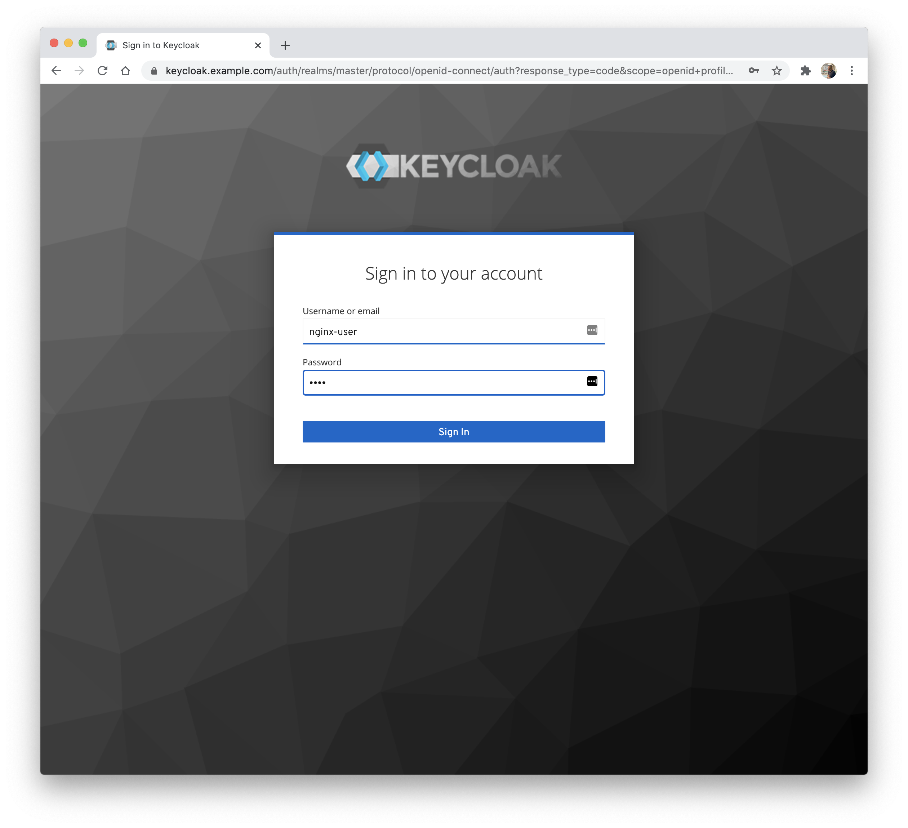
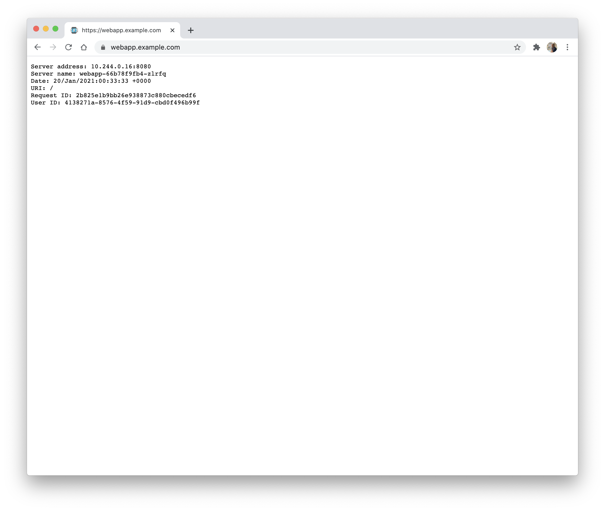

# OIDC

In this example, we deploy a web application, configure load balancing for it via a VirtualServer, and protect the application using an OpenID Connect policy and [Keycloak](https://www.keycloak.org/).

## Prerequisites

1. Follow the [installation](https://docs.nginx.com/nginx-ingress-controller/installation/installation-with-manifests/) instructions to deploy the Ingress Controller. This example requires that the HTTPS port of the Ingress Controller is `443`.
1. Save the public IP address of the Ingress Controller into `/etc/hosts` of your machine:
    ```
    ...

    XXX.YYY.ZZZ.III webapp.example.com
    XXX.YYY.ZZZ.III keycloak.example.com
    ```
    Here `webapp.example.com` is the domain for the web application and `keycloak.example.com` is the domain for Keycloak.

## Step 1 - Deploy a TLS Secret

Create a secret with the TLS certificate and key that will be used for TLS termination of the web application and Keycloak:
```
$ kubectl apply -f tls-secret.yaml
```

## Step 2 - Deploy a Web Application

Create the application deployment and service:
```
$ kubectl apply -f webapp.yaml
```

## Step 3 - Deploy Keycloak

1. Create the Keycloak deployment and service:
    ```
    $ kubectl apply -f keycloak.yaml
    ```
1. Create a VirtualServer resource for Keycloak:
    ```
    $ kubectl apply -f virtual-server-idp.yaml
    ```

## Step 4 - Configure Keycloak

To set up Keycloak:
1. Follow the steps in the "Configuring Keycloak" section of the documentation [here](https://docs.nginx.com/nginx/deployment-guides/single-sign-on/keycloak/#configuring-keycloak):
    1. To connect to Keycloak, use `https://keycloak.example.com`.
    1. Make sure to save the client secret for NGINX-Plus client to the `SECRET` shell variable:
        ```
        SECRET=value
        ```
1. Alternatively, execute the commands [here](./keycloak_setup.md).


## Step 5 - Deploy the Client Secret

1. Encode the secret, obtained in the previous step:
    ```
    $ echo -n $SECRET | base64
    ```

1. Edit `client-secret.yaml`, replacing `<insert-secret-here> ` with the encoded secret.

1. Create a secret with the name `oidc-secret` that will be used by the OIDC policy:
    ```
    $ kubectl apply -f client-secret.yaml
    ```

## Step 6 - Deploy the OIDC Policy

Create a policy with the name `oidc-policy` that references the secret from the previous step:
```
$ kubectl apply -f oidc.yaml
```

## Step 7 - Configure NGINX Plus Zone Synchronization and Resolver

In this step we configure:
* [Zone Synchronization](https://docs.nginx.com/nginx/admin-guide/high-availability/zone_sync/). For the OIDC feature to work when you have two or more replicas of the Ingress Controller, it is necessary to enable zone synchronization among the replicas.
* The resolver, so that an NGINX Plus can discover the other Ingress Controller replicas and resolve the Keycloak endpoint.

Steps:
1. Deploy a headless service for the Ingress Controller.
    ```
    $ kubectl apply -f nginx-ingress-headless.yaml
    ```
1. Get the cluster IP of the KubeDNS service:
    ```
    $ kubectl -n kube-system get svc kube-dns
    NAME       TYPE        CLUSTER-IP   EXTERNAL-IP   PORT(S)         AGE
    kube-dns   ClusterIP   10.4.0.10    <none>        53/UDP,53/TCP   9d
    ```
1. Edit the ConfigMap `nginx-config.yaml`, replacing the `<kube-dns-ip>` with the IP obtained in the previous step.
1. Apply the ConfigMap:
   ```
   $ kubectl apply -f nginx-config.yaml
   ```

## Step 8 - Configure Load Balancing

Create a VirtualServer resource for the web application:
```
$ kubectl apply -f virtual-server.yaml
```

Note that the VirtualServer references the policy `oidc-policy` created in Step 6.

## Step 9 - Test the Configuration

1. Open a web browser and navigate to the URL of the web application: `https://webapp.example.com`. You will be redirected to Keycloak.
1. Log in with the username and password for the user you created in Keycloak, `nginx-user` and `test`.

1. Once logged in, you will be redirected to the web application and get a response from it. Notice the field `User ID` in the response, this will match the ID for your user in Keycloak.

