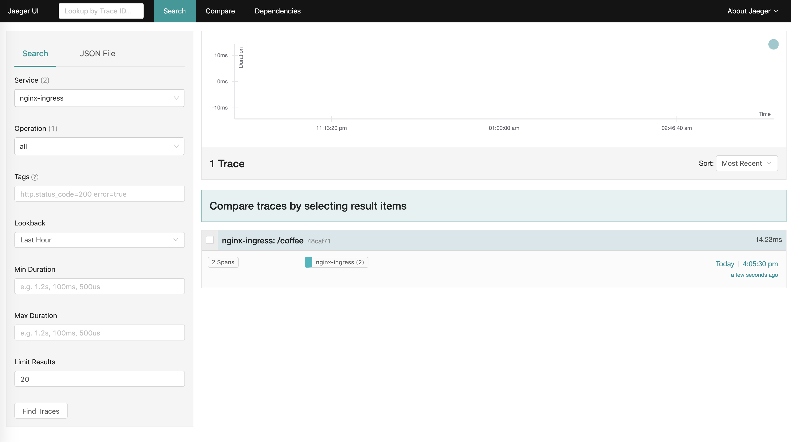

# OpenTracing Support

In this example we deploy the NGINX or NGINX Plus Ingress Controller and a simple web application. Then we enable OpenTracing and use a tracer (Jaeger) for tracing the requests that go through NGINX or NGINX Plus to the web application.

## Prerequisites

The default Ingress Controller images do not include the OpenTracing module required for this example. See Step 1 of the [Prerequisites section](https://docs.nginx.com/nginx-ingress-controller/third-party-modules/opentracing/#prerequisites) in the OpenTracing doc for the instructions on how to get the right image with Jaeger tracer.

## Step 1 - Deploy Ingress Controller and the Cafe App

Follow steps 1-3 of the [complete example](../complete-example/README.md) to deploy the Ingress Controller and the cafe app. Make sure to use the Ingress Controller  image with the OpenTracing module and the tracer installed.

## Step 2 - Deploy a Tracer

1. Use the [all-in-one dev template](https://github.com/jaegertracing/jaeger-kubernetes#development-setup) to deploy Jaeger in the default namespace. **Note:** This template should be only used for development or testing.
   ```
   kubectl create -f https://raw.githubusercontent.com/jaegertracing/jaeger-kubernetes/master/all-in-one/jaeger-all-in-one-template.yml
   ```

2. Wait for the jaeger pod to be ready:
   ```
   $ kubectl get pod

   NAME                      READY     STATUS   
   jaeger-6c996dbcd9-j5jzf   1/1       Running
   ```

## Step 3 - Enable OpenTracing
1. Update the ConfigMap with the keys required to load OpenTracing module with Jaeger and enable  OpenTracing for all Ingress resources.
   ```
   kubectl apply -f nginx-config.yaml
   ```

## Step 4 - Test Tracing
1. Make a request to the app. 
   
   **Note:** $IC_HTTPS_PORT and $IC_IP env variables should have been set from the Prerequisites step in the complete-example installation instructions.
   ```
   curl --resolve cafe.example.com:$IC_HTTPS_PORT:$IC_IP https://cafe.example.com:$IC_HTTPS_PORT/coffee --insecure
   ```
1. Forward a local port to the Jaeger UI port on the Jaeger pod:
   ```
   kubectl port-forward <YOUR_JAEGER_POD> 16686:16686
   ``` 
1. Open Jaeger dashboard in your browser available via http://localhost:16686. Search for the traces by specifying the name of the service to `nginx-ingress` and clicking `Find Traces`. You will see:


